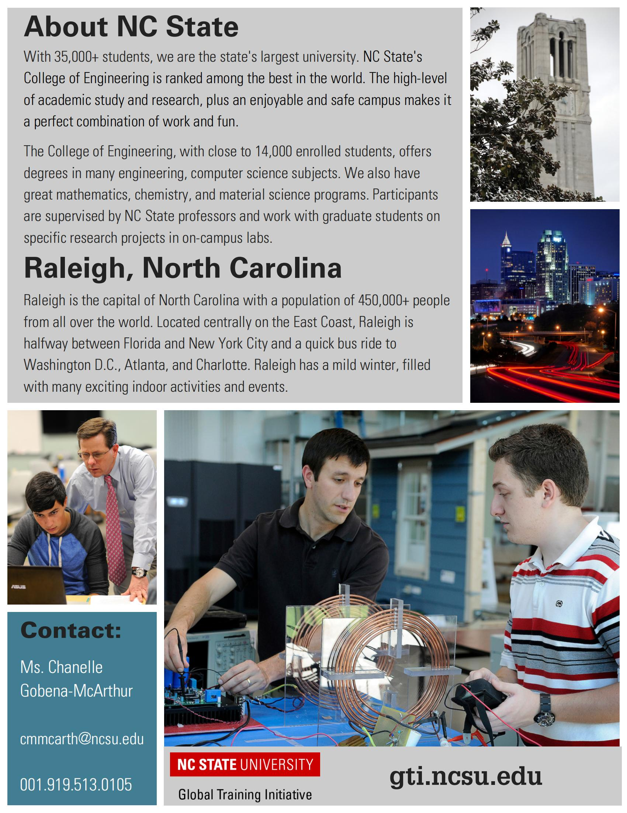

# 项目介绍
!!! tip "项目简介"

    **2024 Summer Undergraduate Campus GEARS Program（Global Education, Academic & Research Skills）**

    

        
    

    North Carolina State University is a public research university in the United States. This 4 week long immersive campus opportunity is an intensive research skills program. The participants will be assigned to existing research teams, and finish a small task during these 4 weeks. The participants will present at a poster symposium upon their successful completion of their research accomplishment at the end of this program. The participants will gain research experience, and learn how to communicate with diverse teams. We will issue the graduation certificate and evaluation letter to the participants. This is a very valuable opportunity for students who are interested in research.

??? note "所含专业"

    * Computer Science
    * Biological Engineering and Agricultural Engineering
    * Chemical and Biomolecular Engineering
    * Crop and Soil Sciences
    * Data Science
    * Forestry and Environmental Resources
    * Industrial and Systems Engineering
    * Mathematics
    * Mechanical Engineering
    * Aerospace Engineering
    * Nuclear Engineering
    * Textiles

!!! success "预期收获"
    
    Hands-on lab research experience and mentoring from NC State faculty and their research teams

    * 4-week long intensive program including arrival/departure transportation and presentation symposium
    * Certificate & evaluation letterWork with world leading faculty in state-of-the-art facilities
    * Weekly social and cultural activities
    * Interact with students from the US and around the world

!!! info "项目海报"

    
    

!!! info "项目日历"

    
    