## 日常生活
在这里的日常生活非常便利！校园巴士串联起食堂、寝室、实验室、图书馆等主要地点。而且你会感受到人与人之间的热情与温暖。我们入乡随俗，习惯了在上下车时对司机进行问候，“Good morning!” “Have a nice day!” “Thank you!” 这些简单的问候为每天增添了不少正能量，让人仿佛回到了那个大家都很友好和温暖的过去。

<figure>
    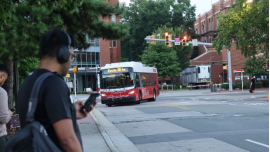
    <figcaption>免费的校园巴士</figcaption>
</figure>

在这里，学习和锻炼可以两不误。健身房超级完善豪华。我喜欢每天下班之后去跑步和游泳。可以感受到美国人是真的很喜欢锻炼，除了食堂，健身房应该是同学最多，校园里最热闹的地方。每天规律的作息和锻炼真的让这个暑假和之前摆烂过去的假期很不一样！

<figure>
    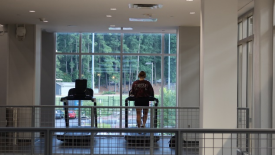
    <figcaption>喜欢在这个角落跑步</figcaption>
</figure>

在这里，除了科研，你还可以体验美国丰富多彩的校园生活，比如参与公益活动。通过这些活动，你可以感受到中美文化的差异。美国的食品救济站遍布全国，即使在一个有15%贫困人口的大学，整个福利制度依然十分完善。我们曾在一个周末前往学校的救济站进行志愿服务，帮助检查食品和生活用品的保质期。让我印象深刻的是，美国的救济站几乎无所不包，不仅提供食品和饮料，还包括婴儿用品、药物等，服务细致入微。当然你也会发现，美国的志愿活动也和中国大学一样，和奖学金和评优评先挂钩，功利的心理其实也存在。

<figure>
    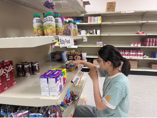
    <figcaption>在大学里的志愿活动</figcaption>
</figure>

在这里，你还可以感受美国的体育文化！我一共去看了两场体育比赛，一场是曼城vs凯尔特人的足球赛，一场是美国州际的棒球赛。只有在这种赛事上你才发现美国也可以人挤人，人真的太多啦！

<figure>
    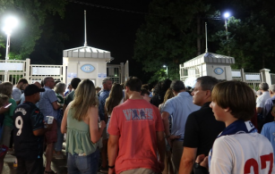
    <figcaption>北卡教堂山的足球赛结束时</figcaption>
</figure>

<figure>
    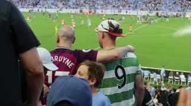
    <figcaption>球迷们</figcaption>
</figure>

<figure>
    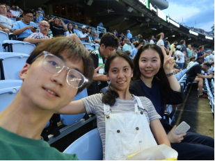
    <figcaption>看球赛时候的合影</figcaption>
</figure>

在这里，你也可以和美国人一样，体验各种户外运动。周末的时候，和朋友们一起去周边的湖进行划船。

<figure>
    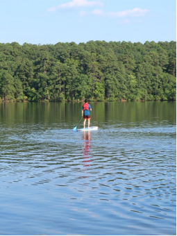
    <figcaption>划船的同学</figcaption>
</figure>

<figure>
    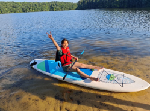
    <figcaption>划船初体验</figcaption>
</figure>

在这里，你也可以品尝到各种美食！平时下班的时候就喜欢奖励自己吃一顿好吃的。于是打卡了北卡州立美食一条街的几乎所有餐厅。墨西哥菜、地中海菜、印度菜、传统美国菜“汉堡”，都试了个遍。也在味蕾承受不住白人饭的攻击之后，吃到了当地华人煮的麻辣烫。不过，校园的自助食堂也很不错！披萨、意大利面、汉堡还有一条自制沙拉的吧台，可以让你自由选择。

<figure>
    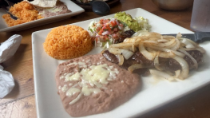
    <figcaption>分量超足的墨西哥菜</figcaption>
</figure>

<figure>
    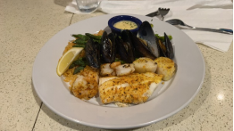
    <figcaption>经典海鲜饭</figcaption>
</figure>

<figure>
    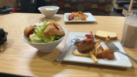
    <figcaption>学校的自助食堂</figcaption>
</figure>

<figure>
    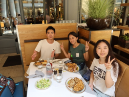
    <figcaption>经典美餐</figcaption>
</figure>

在这里，你还可以在华盛顿肯尼迪剧院看一场酣畅淋漓的音乐剧。

<figure>
    
    <figcaption>音乐剧</figcaption>
</figure>

## 交流
在北卡的时候，主动报名担任“学生大使”，于是获得了和Lynn Wang老师的交流机会。当时几个学生大使在一起和老师聊了四个小时，老师聊了自己为什么留在美国，我们以后应该怎么申请海外博士，怎么写英文邮件，美国的生活究竟是怎么样的。王老师、Michelle、Madison、Dylan等GTI的工作人员真的特别照顾人！我在期间丢了很多次东西，也闯了一些小祸，遇到了一些困难，老师们都帮忙解决了，哭！没有他们真的不知道在美国遇到这些麻烦该怎么办了。

也有在公交车站的闲聊。在等车去图书馆的时候遇到了一个白人老人。他是重视狂热的MAGA，而我来自社会主义的中国。彼此坚定自己的信念，但也在交流中分享彼此的观点。虽然最后谁也没有说服谁，但是在下车之后，我们两人和平握手。这怎么不算是一次成功的“中美交流峰会”。

在美国最感动的一次经历应该是两个帮助流浪汉的大学生吧。当时从Target出来，看到小哥哥小姐姐将买的枕头送给了躺在路边椅子上的流浪汉，当时流浪汉真的抱着枕头哭了出来，有了这个枕头之后，她今晚的梦也应该会香甜一些吧。

<figure>
    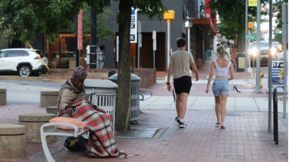
    <figcaption>抓拍到的“感动美国”</figcaption>
</figure>

## 其他
在美国的过程中，我也遇到了一些危险，见识到了这个国家光鲜亮丽外表下的阴暗面。在华盛顿时，由于地铁坐错线路，我来到了非裔美国人聚居的Anacostia。地铁上几个女孩打起了群架，下车时，本打算叫Uber，却被两个堵在门口的黑人小哥吓得不敢出站。虽然没有真正进入贫民窟，但这一经历仍然惊险异常。回家后，我看了纪录片《看不见的孩子》，了解到美国福利制度失败的一面，才真正感受到种族主义的暗流涌动。回想起白人比例高达90%的体育比赛和音乐剧，我突然意识到，美国也有属于它的难题。

终于真正踏上了这片土地，看到了最真实的美国，体验到了美国大学生活的方方面面。有美好的一面，也有无奈的一面。GEARS项目不仅为我带来了丰富而充实的科研经历，也为我打开了一扇窗，让我得以窥见最真实的美国。

作者：cyy