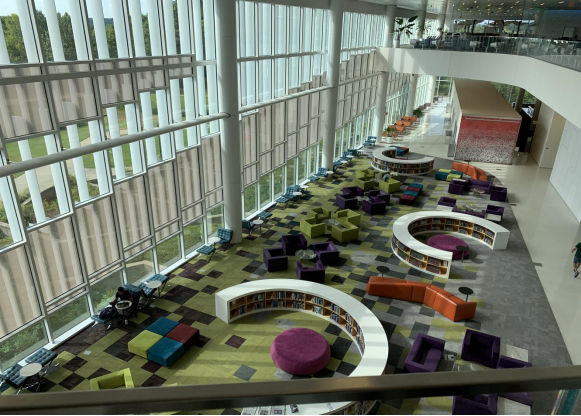
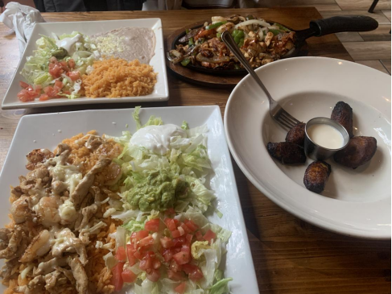
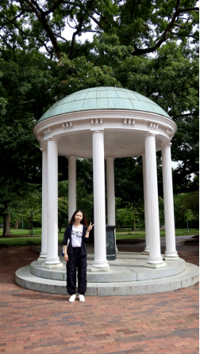
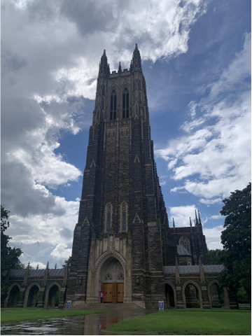
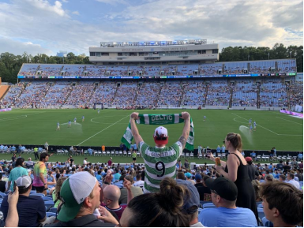
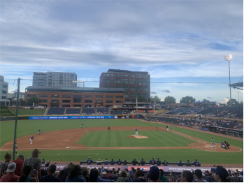
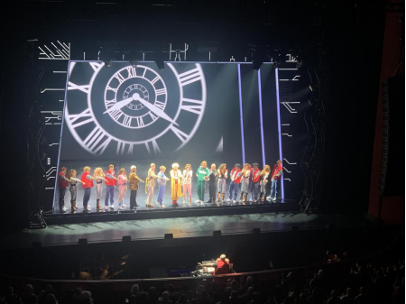
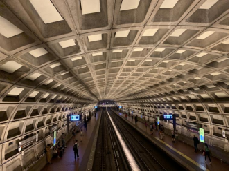
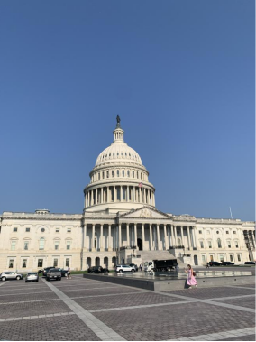

## 生活日常
NCSU的校园生活多姿多彩，有着我最爱的图书馆、方便的校园巴士、downtown的超市以及一家家美食等待探索，无疑使得平淡的科研生活增添了风味。大家在校园中戴着耳机行色匆匆各自奔往学习或生活的目的地，让这个校园对“i人”充满着吸引力。

<figure>
    
    <figcaption>NCSU的图书馆</figcaption>
</figure>

在这里，我也品尝了很多美食，虽然也有“踩雷”的白人饭，但现在回忆起来也是好坏参半，回忆总是美好的。一条街上的餐馆：墨西哥餐、地中海餐、印度餐、意大利餐甚至中餐，一家家和同学一起吃过去，无疑创造了每天生活的期盼和美妙的体验。在味蕾承受不住攻击时再去来一碗天价的麻辣拌，感觉确实好很多。校园的自助也很丰盛，也是很多同学的选择。

<figure>
    
    <figcaption>墨西哥餐更满足中国胃</figcaption>
</figure>

在项目期间，我们也跟随项目老师参观了北卡罗来纳学校教堂山分校和杜克大学，无疑增加了两个我的梦校。由于时间的原因，我们只是匆匆看过两所学校，但仍然让我印象深刻。在北卡教堂山的那一抹代表学校的北卡蓝，还有学期初保佑学生满绩的喝水池。而杜克大学美丽的花园还有宏伟的教堂更让人难忘。

<figure>
    
    <figcaption>学期初保佑学生满绩的水井</figcaption>
</figure>

<figure>
    
    <figcaption>杜克大学的教堂</figcaption>
</figure>

在这里，我们也有幸看到了精彩的球赛，可以说是我在美国见到人口密度最大的地方。我们看了两场球赛，一场足球球赛曼彻斯特对战凯尔特人的表演赛，还有一场棒球赛在达勒姆为主场。在足球赛中我感受到了国外球迷们热烈的现场氛围，客队球迷在指定区域大声唱歌，以及人浪还有可爱的小朋友球迷。而在棒球赛中说来惭愧，我们花费了大部分时间在研究比赛规则以及区分胜负上，由于我们从小都没有参与过这类运动因此了解度不够。不过好在最后我们研究出了胜负规则也很好的享受了比赛过程。

<figure>
    
    <figcaption>足球赛现场热情的球迷</figcaption>
</figure>

<figure>
    
    <figcaption>现场氛围同样热烈的棒球赛</figcaption>
</figure>

在项目最后我们去了华盛顿。在这里，我们去了华盛顿肯尼迪剧院享受了无字幕的音乐剧，“back to the future”。现场氛围热烈，成功抹去了一部分的语言障碍。尽管这是一个老生常谈的经典电影剧目，但现场版的音乐剧仍然常看常新，尤其是谢幕的部分，每位优秀的演员从他们的角色中抽离出来后，使整个剧目更加的完整鲜活。

<figure>
    
    <figcaption>音乐剧的谢幕部分</figcaption>
</figure>

## 其他
但是，说到这次的经历就不得不提及美国社会的两面性。这次出访很不幸，我确实遇到了些危险。在华盛顿时，由于做错了线路和方向，我们误入了人烟稀少的非裔美国人聚居区Anacostia站。在地铁上几个女孩在我们不远处一个车厢打架，站台上有警察但警察并不能真正控制他们的行为，又或者说我们这些闯入者才更值得怀疑。整个旅程的地铁上并不安全，发生着各种匪夷所思的事情。但好在我们安全回了酒店，此时天还是亮的。在这条据说为全美最完善最豪华的地铁中，尚且会遇到这种事，实在不敢想象在其他地区会怎样。

<figure>
    
    <figcaption>华盛顿地铁站</figcaption>
</figure>

这次经验也彻底让我对于美国之旅冷静了下来，开始思考每个国家都有自己的不完善之处，世上也从来没有十全十美的地方。对于我们新时代的青年，应该以更勇敢的姿态面向世界，走向世界，向外展示自己的自信与文化，求同存异；向内剖析自我，挖掘更多自己的可能性和根基所在；以更加客观、包容的视角接纳万物，理解万物。比起只看表面的社会规则与人文风情，更要深入理解其形成的原因与历史，由此才会有更广阔的胸襟来应对迈向世界时所面临的挑战。

<figure>
    
    <figcaption>美国国会大厦</figcaption>
</figure>

作者：wyh