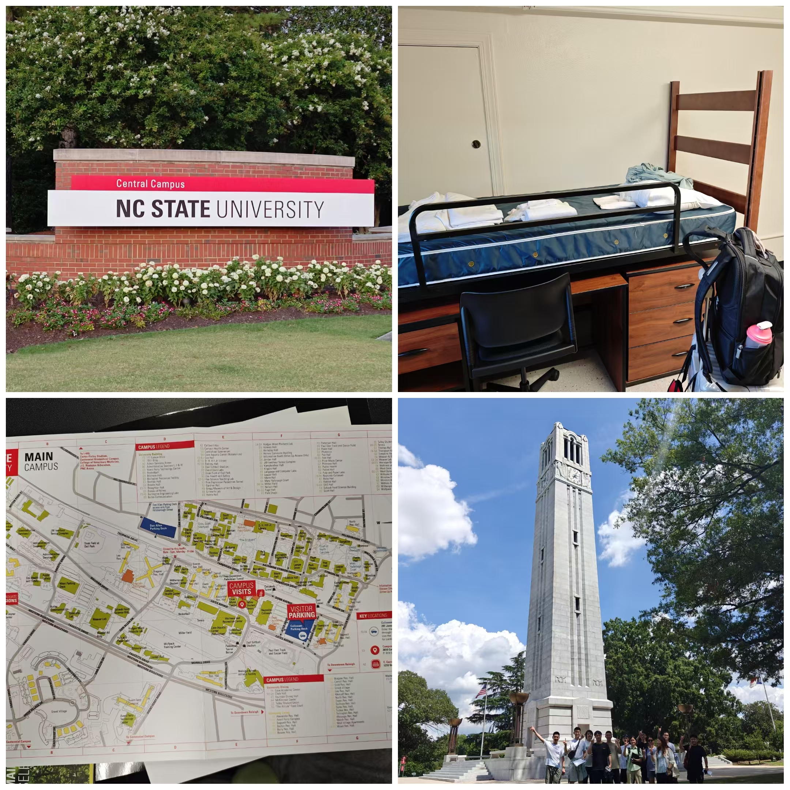
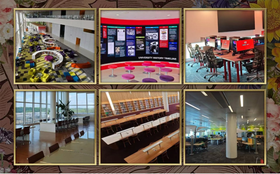
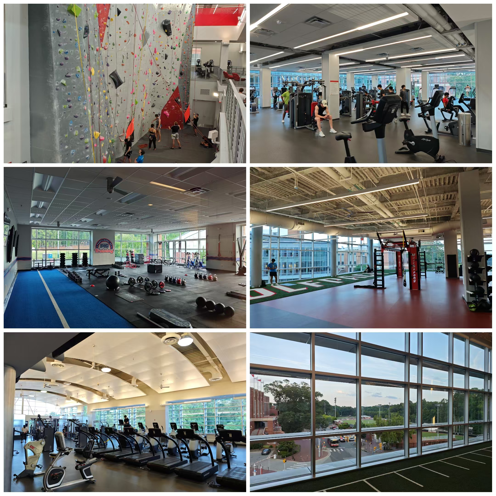
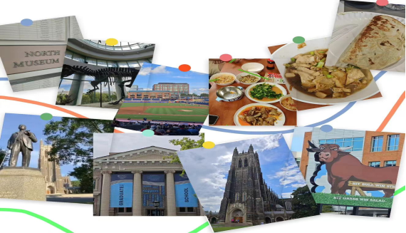
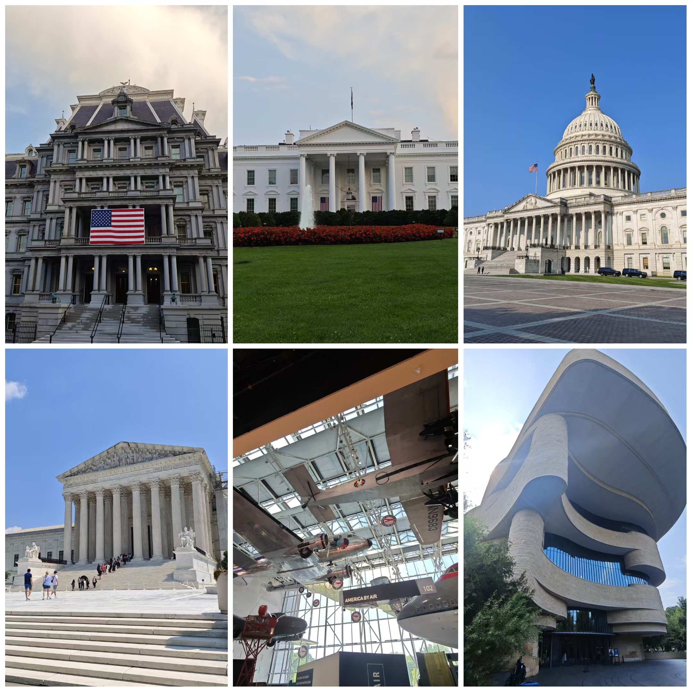

## 行前准备
三月中旬的一天，我从一个推文了解到这个项目，燃起了我想利用暑假探寻海外大学实验室如何开展科研活动的好奇心。我很快就在NCSU官网报了名。

这种暑研项目需要持 J1 签证入境。于是在收到校方发来Ds2019表获得ID号后，我第一时间预约了美国大使馆的面签，注意面签时需携带已缴纳SEVIS I-901的证明。

待面签通过后我着手预订机票，因为NCSU坐落的罗利市目前没有国内直飞的航线，因此买机票大的原则就是减少中转次数、行李直挂、由罗利市入境以及飞机到达时间等因素综合考量，最后订了经巴黎转机的法航机票。非常幸运的是，出发当天我们在机场就集结了一个8个人的营友团，大家可以提前熟络一下，相伴度过漫长的旅途。

在经过27个小时的旅途，我们终于抵达罗利德罕姆机场并顺利入关，校方派专车接我们到达住宿区.

寝室为两人一间，共用一个厕所和淋浴间。每人有独自的床、桌椅、衣柜，室内配有空调。标准的床铺上已为我们准备了洗漱用品、床单、枕头和毛巾。洗衣机和烘干机在一楼公用，此外还有独立的厨房和常用的餐具。

<figure>
    
    <figcaption>初到北卡</figcaption>
</figure>

## 初识NCSU
第一天我们前去参观校园。

听随行的志愿者为我们介绍，学校位于的州首府罗利市被评为全美最宜居的城市，安全指数很高。

校车是校内的主要交通工具，也可以跑校外，非常方便和安全。此外同学们还可以绑定信用卡在校区使用电动滑板车。

学校有4个食堂，学校附近有一条街叫Hillsborough St有各国餐厅及快餐店，选择非常丰富。

但校内所有消费都需要刷卡不收现金，所以建议同学们在国内办好信用卡或是来当地办理PNC bank的借记卡储值使用。拥有237年办学历史的校区环境很好，古老的建筑搭配新建的设施，既古朴又现代。

给我印象最深的就是图书馆和健身馆，图书馆还获得了著名的斯坦福大学研究图书馆创新奖。学生可以自费办理有效期一个月的健身卡参加各种体育俱乐部、运动项目和健身计划等。

<figure>
    
    <figcaption>图书馆</figcaption>
</figure>

<figure>
    
    <figcaption>体育馆</figcaption>
</figure>

## 丰富多彩的课余生活
在周一至周五的每日8a-5p的个人项目学习之外，学校为我们安排了丰富多彩的课余生活。

有电影晚会、西厨甜品制作，我们也会在设备齐全的厨房做做中餐，摆脱一下白人饭。

周末，GTI组织了一系列活动：

我们参观了北卡罗莱纳州历史博物馆、自然科学博物馆、同在罗利市与NCSU共同组成科学研究三角园的北卡罗来纳大学教堂山分校、杜克大学。

还参观了北卡州棒球德海姆公牛队的主场，观看了一场精彩的棒球比赛，我还下场体验了全垒跑并非常幸运地得到了球员的签名。

最后两天的华盛顿之旅我们游览了白宫、国会大厦、航天博物馆等美国标志性建筑，为我们此次暑研活动画上了圆满的句号。

<figure>
    
    <figcaption>北卡游历</figcaption>
</figure>

<figure>
    
    <figcaption>华盛顿之行</figcaption>
</figure>

作者：zhc