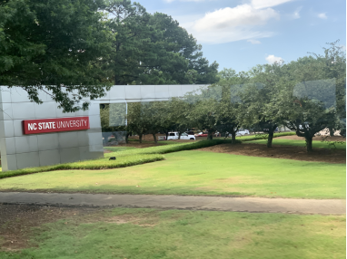
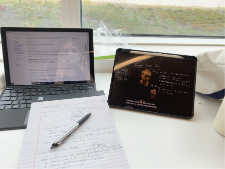
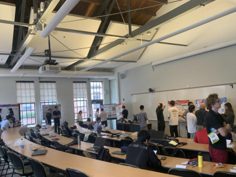
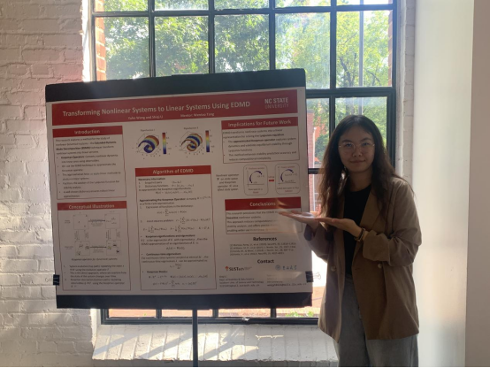

# Data-Driven Methods for Dynamical Analysis of Nonlinear Systems
## 项目经历

在报名初期，NCSU为我们提供了涵盖计算机、工程、生物等多个领域，每个学生都可以选择自己感兴趣的方向进行学习。结合我的专业以及项目招收同学的建议，我报名了”Data-Driven Methods for Dynamical Analysis of Nonlinear Systems”。比起其它计算机与实验室相关的工程项目，这更偏向于一个工程理论类的方向。在四周工作学习中，我开始逐步学习简单的机器学习以及EDMD方法，逐步深入了解了非线性系统。

<figure>
    
    <figcaption>初次坐车抵达校园</figcaption>
</figure>

抵达北卡后，在orientation day我们首先见到了自己相应项目的教授，一起进行了午餐交流会。我们的教授唐文涛老师是一位华人教授，有着丰富的学习与科研经验。我们进行了很多有趣的沟通，并为接下来项目的推进打下了坚实的基础。在这之后，我们一起以趣味游戏打卡的方式参观了校园，在学生中心办理校园卡，仿佛我们就是学校的新生即将入学。这无疑是奇妙的体验。

第一周的学习任务不算太重，在与教授见面后，我们很快确定了想要研究的问题与方向。确定为李雅普诺夫方程对非线性转化为线性的作用研究。在教授的指导下，我们针对性的阅读了相关文献，学习了将非线性系统转化为线性系统的关键要素EDMD算子。由于这个项目更多为理论学习，所以同组合作与交流就显得略少。但我们仍然积极讨论提出疑问解答疑问，通过文献阅读学习了此前未接触过的知识。

<figure>
    
    <figcaption>在图书馆学习</figcaption>
</figure>

第二周开始，在我们汇报完学习情况后，教授布置了让我们用代码实现EDMD算法的过程，以加深我们对该算法的理解。在写代码以最小的误差运行的同时，我产生了很多新的问题并且发现我对EDMD算法的了解不够深入。在此期间，我主要解决了代码输入数据例子多样性以及矩阵维度与输入数据的关系。尽管最终代码还不够完善，但仍然最大限度的满足了该算法运行的规则。

在这个过程中，我与教授进行了多次的邮件沟通，积极提出我所遇到的困境与疑惑。教授会在第一时间回复我的邮件并解答我的困惑，并在我提出需要具体例子来完善代码时给我耐心的讲解，使我对此了解更深。

在项目的最后，我们还安排了海报展示与演讲环节，所有项目的参与同学齐聚一堂，分享自己在这四周的学习与成果。这个环节模拟了学术会议的交流，是科研成果展示的重要部分，学术氛围十分浓厚。而很多教授与博士生也被吸引而来到我们的展会，与同学们进行了更加深入的交流与见解，同时，更是分享了在这里读书学习的感受，让我们对海外学习有了更加深入的了解与直观的感受。

<figure>
    
    <figcaption>海报交流会</figcaption>
</figure>

在我展示的期间，唐老师也来到了海报交流会上，并跟我们讲了更多关于他的研究方向及读书的具体事宜，让我受益匪浅，认识到了一个全新的研究视角以及领域，使我对未来考虑的方向更为广阔。同时他也教授我们很多关于海报制作的细节与思考，旨在让我们学到更多理解更多角度。

<figure>
    
    <figcaption>我与我们海报的合照</figcaption>
</figure>

作者：wyh