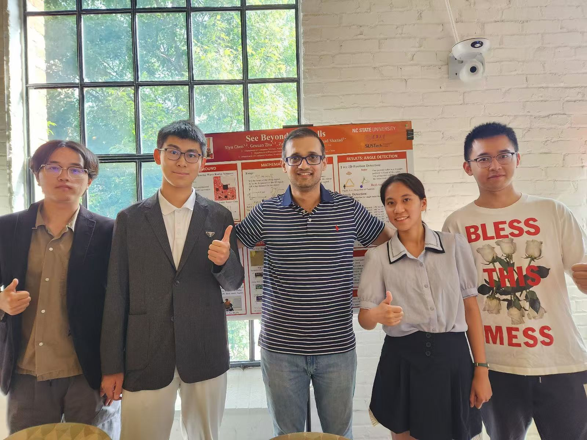

# See Beyond the Walls

## 项目介绍
本项目属于计算机网络领域下 Wireless Sensing 模块，旨在让同学们了解雷达并使用雷达进行测距、测速和测角，最终借助雷达的穿透性完成该领域最重要的两个基础课题：**墙后物体运动探测和二维平面位置确定**。

## 导师
{ width=17%; align=left }

本项目的导师是: 

北卡罗莱纳州立大学计算机系助理教授 Muhammad Shahzad。

他的研究方向包括：Mobile Sensing and Computing, Internet of Things, and Computer Networks, with a focus on wireless sensing with ubiquitous modalities (such as radio signals, sound, light) and network measurement and modeling.

Shahzad 教授和他的研究团队在计算机网络、人机交互等领域卓有建树，在网络方向顶会：MobiCom, INFOCOM; 人机交互方向顶会：CHI, UbiComp 等会议上均有论文发表。

## 项目经历

在出发前，教授便通过邮件向我们分享了雷达基础知识以及他实验室的奠基之作，让我们能够提前了解即将展开的四周任务。

<figure>
    
    <figcaption>文献综述</figcaption>
</figure>

第一周的任务从背景调研开始，小组成员通过合作交流，很快掌握了雷达的基本数学原理，其中包括测距、测速和测角，用到了傅里叶变换等一系列数学知识。在教授的鼓励下，我们广泛阅读了与雷达相关的文献，梳理了该领域的发展脉络与未来趋势。更为重要的是，通过集思广益，我们讨论了雷达的其他潜在应用，例如利用雷达的穿透性来探测自动驾驶的视野盲区，帮助消防员定位被困人员，从而提高救援效率并降低风险。正如 Muhammad Shahzad 教授所言，一个好想法才是最珍贵的。最后，我们将自己的探索和调研梳理成了一个文档，与博士生学姐交流。

<figure>
    
    <figcaption>报告一角</figcaption>
</figure>

第二周开始，我们便着手进行雷达的数据处理，以验证上周所学的知识是否扎实。我们使用博士生学姐采集的数据，进行了傅里叶变换等分析。然而，这个过程并不如预期般顺利。我们最初的推导和证明仅考虑了二维情况，直到代码编写完成后才意识到应当计算三维情境。为了攻克这个难题，小组四人在图书馆展开了长时间的讨论，最终成功解出了三维解法。我们将自己的报告提交给了教授的博士生学姐，他们对我们的速度和热情表示惊叹，称这是多年来GEARS项目中进度最快的一次。

第三周的时候，我们终于拿到了雷达硬件，开始自己做实验和写代码。使用硬件总是会遇到一些问题，所以第一天的时候我们对着雷达一筹莫展。最后我们仔细查阅雷达文档，终于解决了驱动等问题，可以开始采集数据了！这个过程还是碰壁很多，但是在小组讨论和与教授交流的过程中，一定能找到解决方案。

最终我们完成了两个任务：墙后物体运动探测和二维平面位置确定。

<figure>
    
    <figcaption>设计实验场景</figcaption>
</figure>

<figure>
    
    <figcaption>墙后人位置的探测</figcaption>
</figure>

在项目的最后阶段，GTI还特别安排了海报展示和演讲（Pre）环节，所有参与GEARS项目的学生汇聚一堂，分享和交流这四周的收获。这个活动模拟了学术会议中的交流环节，现场氛围十分浓厚。期间，许多教授和博士生陆续来到我们的海报前，与我们深入讨论项目的成果与见解，当然也闲聊了关于海外读博的体验和经历等，让我们对于海外学习等有了更加直观的感受。

<figure>
    
    <figcaption>合影</figcaption>
</figure>

    
    
    <figcaption>海报展示</figcaption>

作者：cyy, zhc